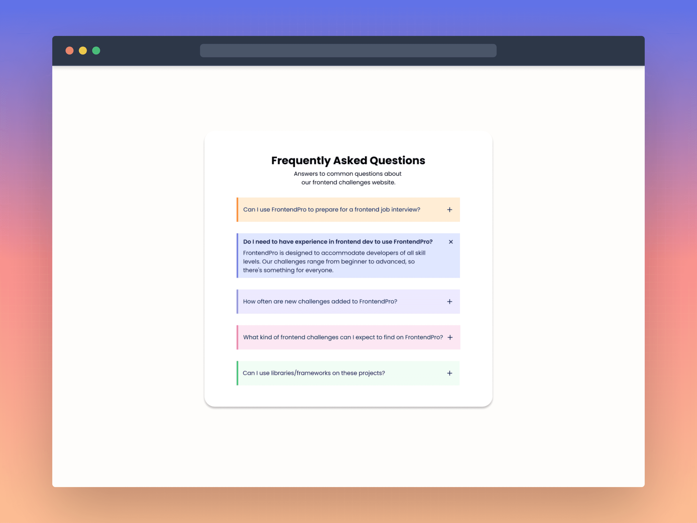

**Challenge Title**
Accordion Component

**Challenge Description**
In this challenge, you'll build an Accordion Component. This challenge is perfect for you if you're interested in building interactive front-end web components and taking your Frontend skills to the next level!

**Difficulty Level**
Intermediate

**Tags**
FRONTEND

**Learning**
In this frontend challenge, You'll learn how to build an Accordion Component from scratch. You'll also learn how to use DOM manipulation to make the component interactive and dynamic. This frontend challenge is a great opportunity to improve your CSS & JavaScript skills and build something cool. You're going to love it!

**Requirements**

- Toggle between the accordion items to expand or collapse their content.
- Change the icon from a plus to a cross icon when the item is expanded.
- Use CSS to style the component and make it visually appealing.
- Responsive design to support different screen sizes.

**Taking your Project to the Next Level**

- Use a framework like React, Vue, or Svelte. Or, if you're feeling particularly adventurous, try writing everything in Vanilla JavaScript.

I hope you'll enjoy building this challenge.

Feel free to share your solution on the website or on social media and tag [us](https://twitter.com/FrontendProHQ).
